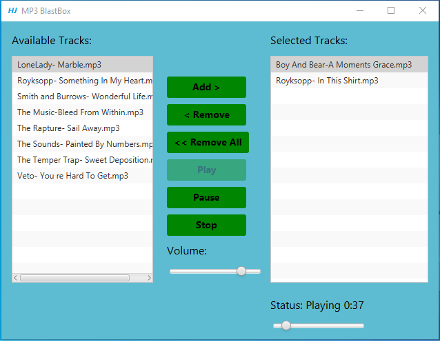

## Javafx-MusicPlayer
---

### Overview

Music Player is a media player application for .mp3 format audio tracks. 
A picture for graphical user interface is shown in image 01. GUI is developed by Javafx. 
At application startup, the list of available tracks is populated from a “music” directory adjacent to where the application is located.
When the “Add” button is clicked, a track selected in the available list is added to the selected tracks list. 
The button is not enabled unless a track is selected in the available list.
When the “Play” button is clicked, the highlighted track from the list of selected tracks is played.
An stylesheet is added to code in order to style the GUI.

### Screenshots
| |
|---|
|  | 